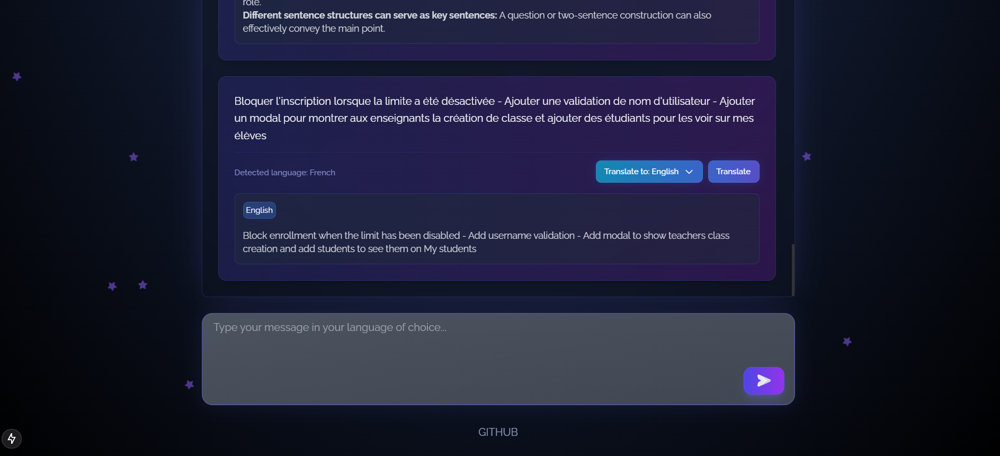

# Cosmic AI Text Processor

A Space themed Next.js application that provides AI-powered text processing capabilities including language detection, translation between supported languages, and text summarization.



## Features

- **Language Detection**: Automatically detects the language of input text
- **Translation**: Supports translation between:
  - English
  - Portuguese 
  - Spanish
  - Russian
  - Turkish
  - French
- **Text Summarization**: Generate concise summaries of English text with options for:
  - Summary type (key points, abstract, etc.)
  - Output format (markdown)
  - Length (short, medium, long)
- **Persistent Storage**: Messages and their states are saved in localStorage
- **Accessibility**: Built with ARIA labels and roles for screen reader support
- **Responsive Design**: Works across desktop and mobile devices

## Getting Started

1. Clone the repository:

```bash
git clone https://github.com/vermilion4/ai-text-processor.git
cd ai-text-processor
```

2. Install dependencies:

```bash
npm install
```

3. Start the development server:

```bash
npm run dev
```

4. Open [http://localhost:3000](http://localhost:3000) in your browser to see the result.
